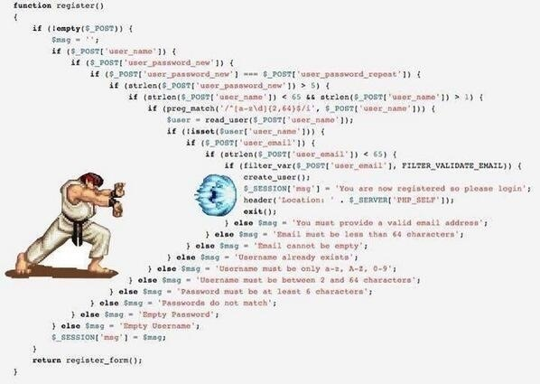
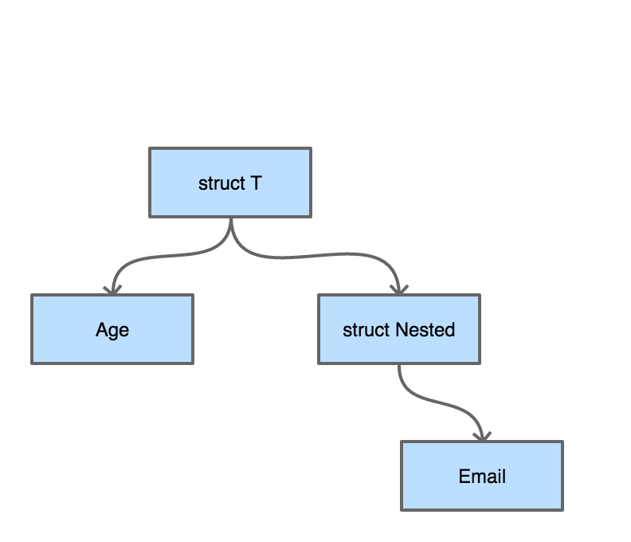

# 5.4 validator 请求校验

社区里曾经有人用*图 5-10*来嘲笑PHP：



*图 5-10 validator 流程*

实际上这是一个语言无关的场景，需要进行字段校验的情况有很多，Web系统的Form/JSON提交只是一个典型的例子。我们用go来写一个类似上图的校验demo。然后研究怎么一步步对其进行改进。

## 5.4.1 重构请求校验函数

假设我们的数据已经通过某个binding库绑定到了具体的struct上。

```go
type RegisterReq struct {
	Username       string   `json:"username"`
	PasswordNew    string   `json:"password_new"`
	PasswordRepeat string   `json:"password_repeat"`
	Email          string   `json:"email"`
}

func register(req RegisterReq) error{
	if len(req.Username) > 0 {
		if len(req.PasswordNew) > 0 && len(req.PasswordRepeat) > 0 {
			if req.PasswordNew == req.PasswordRepeat {
				if emailFormatValid(req.Email) {
					createUser()
					return nil
				} else {
					return errors.New("invalid email")
				}
			} else {
				return errors.New("password and reinput must be the same")
			}
		} else {
			return errors.New("password and password reinput must be longer than 0")
		}
	} else {
		return errors.New("length of username cannot be 0")
	}
}
```

我们在golang里成功写出了hadoken开路的箭头型代码。。这种代码一般怎么进行优化呢？

很简单，在《重构》一书中已经给出了方案：[Guard Clauses](https://refactoring.com/catalog/replaceNestedConditionalWithGuardClauses.html)。

```go
func register(req RegisterReq) error{
	if len(req.Username) == 0 {
		return errors.New("length of username cannot be 0")
	}

	if len(req.PasswordNew) == 0 || len(req.PasswordRepeat) == 0 {
		return errors.New("password and password reinput must be longer than 0")
	}

	if req.PasswordNew != req.PasswordRepeat {
		return errors.New("password and reinput must be the same")
	}

	if emailFormatValid(req.Email) {
		return errors.New("invalid email")
	}

	createUser()
	return nil
}
```

代码更清爽，看起来也不那么别扭了。这是比较通用的重构理念。虽然使用了重构方法使我们的validate过程看起来优雅了，但我们还是得为每一个http请求都去写这么一套差不多的validate函数，有没有更好的办法来帮助我们解除这项体力劳动？答案就是validator。

## 5.4.2 用 validator 解放体力劳动

从设计的角度讲，我们一定会为每个请求都声明一个struct。前文中提到的校验场景我们都可以通过validator完成工作。还以前文中的struct为例。为了美观起见，我们先把json tag省略掉。

这里我们引入一个新的validator库：

> https://github.com/go-playground/validator

```go
import "gopkg.in/go-playground/validator.v9"

type RegisterReq struct {
	// 字符串的 gt=0 表示长度必须 > 0，gt = greater than
	Username       string   `validate:"gt=0"`
	// 同上
	PasswordNew    string   `validate:"gt=0"`
	// eqfield 跨字段相等校验
	PasswordRepeat string   `validate:"eqfield=PasswordNew"`
	// 合法 email 格式校验
	Email          string   `validate:"email"`
}

validate := validator.New()

func validate(req RegisterReq) error {
	err := validate.Struct(req)
	if err != nil {
		doSomething()
		return err
	}
	...
}

```

这样就不需要在每个请求进入业务逻辑之前都写重复的validate函数了。本例中只列出了这个validator非常简单的几个功能。

我们试着跑一下这个程序，输入参数设置为：

```go
//...

var req = RegisterReq {
	Username       : "Xargin",
	PasswordNew    : "ohno",
	PasswordRepeat : "ohn",
	Email          : "alex@abc.com",
}

err := validate(req)
fmt.Println(err)

// Key: 'RegisterReq.PasswordRepeat' Error:Field validation for
// 'PasswordRepeat' failed on the 'eqfield' tag
```

如果觉得这个`validator`提供的错误信息不够人性化，例如要把错误信息返回给用户，那就不应该直接显示英文了。可以针对每种tag进行错误信息定制，读者可以自行探索。

## 5.4.3 原理

从结构上来看，每一个struct都可以看成是一棵树。假如我们有如下定义的struct：

```go
type Nested struct {
	Email string `validate:"email"`
}
type T struct {
	Age	int `validate:"eq=10"`
	Nested Nested
}
```

把这个struct画成一棵树，见*图 5-11*：



*图 5-11 validator 树*

从字段校验的需求来讲，无论我们采用深度优先搜索还是广度优先搜索来对这棵struct树来进行遍历，都是可以的。

我们来写一个递归的深度优先搜索方式的遍历demo：

```go
package main

import (
	"fmt"
	"reflect"
	"regexp"
	"strconv"
	"strings"
)

type Nested struct {
	Email string `validate:"email"`
}
type T struct {
	Age	int `validate:"eq=10"`
	Nested Nested
}

func validateEmail(input string) bool {
	if pass, _ := regexp.MatchString(
		`^([\w\.\_]{2,10})@(\w{1,}).([a-z]{2,4})$`, input,
	); pass {
		return true
	}
	return false
}

func validate(v interface{}) (bool, string) {
	validateResult := true
	errmsg := "success"
	vt := reflect.TypeOf(v)
	vv := reflect.ValueOf(v)
	for i := 0; i < vv.NumField(); i++ {
		fieldVal := vv.Field(i)
		tagContent := vt.Field(i).Tag.Get("validate")
		k := fieldVal.Kind()

		switch k {
		case reflect.Int:
			val := fieldVal.Int()
			tagValStr := strings.Split(tagContent, "=")
			tagVal, _ := strconv.ParseInt(tagValStr[1], 10, 64)
			if val != tagVal {
				errmsg = "validate int failed, tag is: "+ strconv.FormatInt(
					tagVal, 10,
				)
				validateResult = false
			}
		case reflect.String:
			val := fieldVal.String()
			tagValStr := tagContent
			switch tagValStr {
			case "email":
				nestedResult := validateEmail(val)
				if nestedResult == false {
					errmsg = "validate mail failed, field val is: "+ val
					validateResult = false
				}
			}
		case reflect.Struct:
			// 如果有内嵌的 struct，那么深度优先遍历
			// 就是一个递归过程
			valInter := fieldVal.Interface()
			nestedResult, msg := validate(valInter)
			if nestedResult == false {
				validateResult = false
				errmsg = msg
			}
		}
	}
	return validateResult, errmsg
}

func main() {
	var a = T{Age: 10, Nested: Nested{Email: "abc@abc.com"}}

	validateResult, errmsg := validate(a)
	fmt.Println(validateResult, errmsg)
}
```

这里我们简单地对`eq=x`和`email`这两个tag进行了支持，读者可以对这个程序进行简单的修改以查看具体的validate效果。为了演示精简掉了错误处理和复杂case的处理，例如reflect.Int8/16/32/64，reflect.Ptr等类型的处理，如果给生产环境编写validate库的话，请务必做好功能的完善和容错。

在前一小节中介绍的validator组件在功能上要远比我们这里的demo复杂的多。但原理很简单，就是用reflect对struct进行树形遍历。有心的读者这时候可能会产生一个问题，我们对struct进行validate时大量使用了reflect，而go的reflect在性能上不太出众，有时甚至会影响到我们程序的性能。这样的考虑确实有一些道理，但需要对struct进行大量校验的场景往往出现在Web服务，这里并不一定是程序的性能瓶颈所在，实际的效果还是要从pprof中做更精确的判断。

如果基于反射的validator真的成为了你服务的性能瓶颈怎么办？现在也有一种思路可以避免反射：使用golang内置的parser对源代码进行扫描，然后根据struct的定义生成校验代码。我们可以将所有需要校验的结构体放在单独的package内。这就交给读者自己去探索了。
